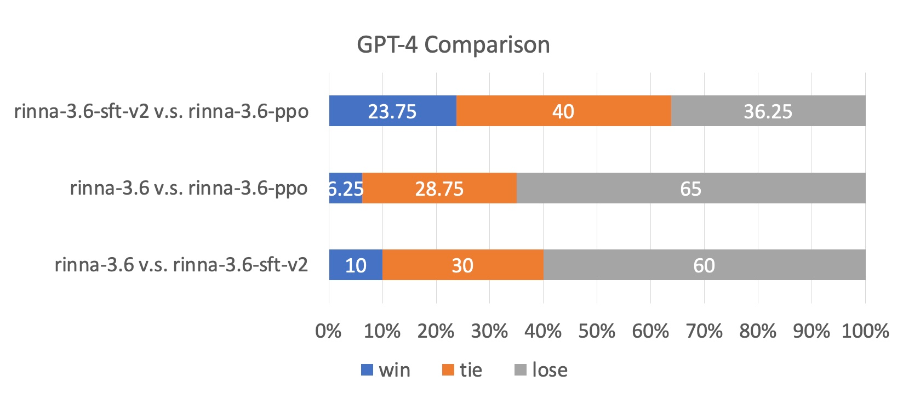

# LLM Judge

In this package, you can use Vicuna-Japanese questions and prompts to evaluate your models with LLM-as-a-judge.
To automate the evaluation process, we prompt strong LLMs like GPT-4 to act as judges and assess the quality of the models' responses.

## Contents
- [Install](#install)
- [Review Pre-Generated Model Answers and Judgments](#review-pre-generated-model-answers-and-judgments)
## Install
```
git clone https://github.com/hitoshizuku7/LLM_Judge_ku.git
cd LLM_Judge_ku
pip install -e .
pip install openai anthropic ray
cd fastchat/llm_judge
```


### Evaluate a model on jp-bench (Vicuna-Japanese)

#### Step 1. Generate model answers to jp-bench questions
```
python gen_model_answer.py \
--base_model [MODEL-PATH] \
--lora_model [LORA-PATH] \
--model-id [MODEL-ID] \
--with_prompt \
--gpus [GPU_Num] \
--max_new_tokens [NUM of NEW TOKENS] \
--benchmark jp_bench
```
Arguments:
  - `[MODEL-PATH]` is the path to the weights, which can be a local folder or a Hugging Face repo ID.
  - `[LORA-PATH]` is the path to the lora weights if needed.
  - `[MODEL-ID]` is a name you give to the model.
  - `[GPU_Num]` denotes which GPU you decide to use


e.g.,
```
python gen_model_answer.py \
--model-path rinna/japanese-gpt-neox-3.6b-instruction-ppo \
--model-id rinna-3.6b-ppo \
--with_prompt \
--gpus 0 \
--max_new_tokens 2048 \
--benchmark jp_bench
```
The answers will be saved to `data/jp_bench/model_answer/[MODEL-ID].jsonl`.

You can also specify `--num-gpus-per-model` for model parallelism (needed for large 65B models) and `--num-gpus-total` to parallelize answer generation with multiple GPUs.

#### Step 2. Generate GPT-4 judgments
There are several options to use GPT-4 as a judge, such as pairwise winrate and single-answer grading.
In MT-bench, we recommond single-answer grading as the default mode.
This mode asks GPT-4 to grade and give a score to model's answer directly without pairwise comparison.
For each turn, GPT-4 will give a score on a scale of 10. We then compute the average score on all turns.

```
OPENAI_API_KEY=[YOUR-KEY] python -B gen_judgment.py \
--bench-name "jp_bench" \
--mode [pairwise-all, single, pairwise-baseline] \
--model-list [LIST-OF-MODEL-ID] \
--parallel [num-concurrent-api-call]
```

e.g.,
```
OPENAI_API_KEY=[YOUR-KEY] python -B gen_judgment.py \
--bench-name "jp_bench" \
--mode single \
--model-list rinna-3.6b rinna-3.6b-ppo \
--parallel 2
```
The judgments will be saved to `data/jp_bench/model_judgment/gpt-4_single.jsonl`

#### Step 3. Show jp-bench scores

- Show the scores for selected models
  ```
  python show_result.py \
  --bench-name "jp_bench" \
  --mode single \
  --model-listrinna-3.6b rinna-3.6b-ppo 
  ```
- Show all scores
  ```
  python show_result.py
  ```

---

### Other grading options
Besides score-based single-answer grading, we also support two additional grading options based on win rates:
- `pariwise-baseline`: run pairwise comparison against a baseline model.
- `pairwise-all`: run pairwise comparison between all model pairs on all questions.

#### Option 2: pairwise comparison against a baseline (default: gpt-3.5-turbo)

- Generate GPT-4 judgments
```
OPENAI_API_KEY=[YOUR-KEY] python -B gen_judgment.py \
--bench-name "jp_bench" \
--mode pairwise-baseline \
--model-list rinna-3.6b rinna-3.6b-ppo \
--parallel 2
```
The judgments will be saved to `data/jp_bench/model_judgment/gpt-4_pair.jsonl`

- Show results
```
python show_result.py \
--bench-name "jp_bench" \
--mode pairwise-baseline
```

#### Option 3: Run GPT-4 judge with all pair comparisons

Another option is to run pairwise comparisons on all possible pairs.
This could be more expensive when #models increases, but it gives you a more comprehensive information.

```
OPENAI_API_KEY=[YOUR-KEY] python -B gen_judgment.py \
--bench-name "jp_bench" \
--mode pairwise-all \
--model-list [LIST-OF-MODEL-ID] \
--parallel [num-concurrent-api-call]
```

```
python show_result.py \
--bench-name "jp_bench" \
--mode pairwise-all
```


## Sample Outputs

### Question: 
時間管理能力を向上させるにはどうしたらいいですか？
### Answer-rinna-3.6b: 
時間管理とは、目標や優先順位を決め、タスクを効果的に実行し、自分自身の人生を管理するスキルです。一般的には、自己モチベーションを高め、生産性を高めるために役立ちます。
### Answer-rinna-3.6b-sft: 
私自身はあまり経験がありませんが、いくつかのアイデアを紹介できます。最も重要なのは、目標を達成するためにどのように計画を立てるかということだと思います。また、毎日やるべきことを書き出す習慣を身につけることも役立つでしょう。
### Answer-rinna-3.6b-ppo: 
時間管理とは、目標や優先順位を決め、タスクを効果的に実行し、自分自身の人生を管理するスキルです。一般的には、自己モチベーションを高め、生産性を高めるために役立ちます。


## Comparison Results
  


## Supported Models
[Rinna-3.6B](https://huggingface.co/rinna/japanese-gpt-neox-3.6b)

[Rinna-3.6B-sft-v2](https://huggingface.co/rinna/japanese-gpt-neox-3.6b-instruction-sft-v2)

[Rinna-3.6B-ppo](https://huggingface.co/rinna/japanese-gpt-neox-3.6b-instruction-ppo)

[Japanese-Alpaca-Lora](https://huggingface.co/kunishou)

